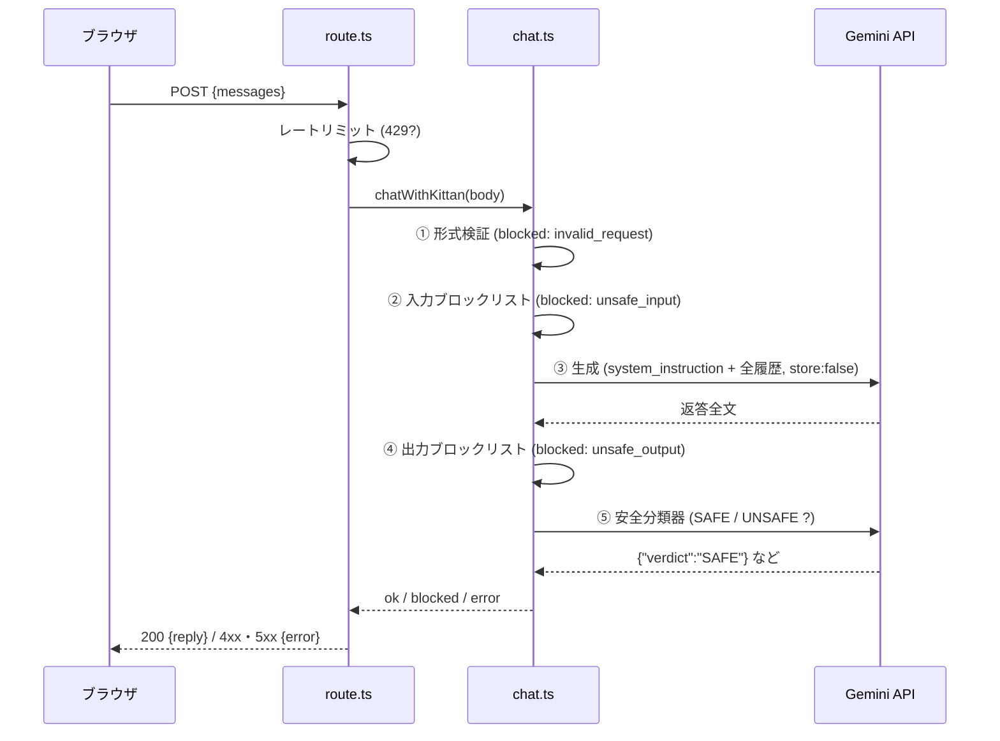

# 「きったんとおしゃべり」チャットボット設計書

ポートフォリオの持ち主 TinyKitten(きったん)本人をモデルにした、おしゃべり相手のAIエージェントの設計書です。
本書は「なぜこの設計なのか」を残すことを主目的とし、コードの読み方は [`lib/kittan/README.md`](../lib/kittan/README.md)、
UI実装時の契約は [`docs/kittan-chat-ui-spec.md`](./kittan-chat-ui-spec.md) に分担しています。

## 1. 要件

| #   | 要件                                                                | 本設計での担保                                                                                                 |
| --- | ------------------------------------------------------------------- | -------------------------------------------------------------------------------------------------------------- |
| 1   | Gemini 3.7 Flash のAIエージェント                                   | `gemini-3.7-flash` を既定モデルとして Interactions API で呼び出し(§4)                                          |
| 2   | X(@tinykitten8)・ポートフォリオ掲載内容・会話コーパスから発言を学習 | ファインチューニングではなく、システムプロンプトへの文脈注入(in-context learning)で実現(§5)                    |
| 3   | 絶対に暴言・公序良俗に反する発言をしない                            | fail-closed の多層ガードレール。全層を通過するまで一切返さず、誤りを「止める」側へ寄せてリスクを最大限低減(§6) |
| 4   | ユーモアセンスが高く優しい性格                                      | システムプロンプトのペルソナ定義+口調コーパス(§5)                                                              |

非機能要件として、次を設計目標に加えています。

- **プライバシー**: 会話をサーバー側(自前・Google側とも)に保存しない
- **可搬性**: Vercel前提だが、Cloudflare Workers へ低コストで移設できる形を保つ
- **テスト容易性**: モデル呼び出しを差し替え可能にし、ネットワークなしで全ロジックを検証できる

## 2. 全体アーキテクチャ

```text
ブラウザ
  └─ POST /api/kittan-chat          app/api/kittan-chat/route.ts
       ├─ レートリミット             lib/kittan/rateLimit.ts   (IP単位 10req/分)
       └─ chatWithKittan()          lib/kittan/chat.ts        ← 司令塔
            ├─ validateChatRequest  lib/kittan/guardrails.ts  (形式・長さ・並び)
            ├─ screenMessages       lib/kittan/guardrails.ts  (入力・ルールベース)
            ├─ buildSystemInstruction lib/kittan/persona.ts
            │    ├─ getKittanCorpus     lib/kittan/corpus.ts    ← data/kittan/corpus.json
            │    └─ getPortfolioFacts   lib/kittan/portfolio.ts ← constants/trivia.ts, fixtures/stories/*
            ├─ generate()           lib/kittan/gemini.ts      (Interactions API / store:false)
            ├─ screenText           lib/kittan/guardrails.ts  (出力・ルールベース)
            └─ moderateOutput       lib/kittan/guardrails.ts  (出力・LLM分類器)
```

レイヤー構造は次の3層で、依存は必ず下向きです。

1. **HTTP層**(`app/api/kittan-chat/route.ts`): リクエストの入出力変換とレートリミットのみ。ドメインの判断をしない。
2. **ドメイン層**(`lib/kittan/chat.ts` ほか): 検証・安全判定・プロンプト構築・結果の型付け。フレームワーク非依存の純TypeScript。
3. **プロバイダ層**(`lib/kittan/gemini.ts`): SDK依存をこの1ファイルに閉じ込める。上位は `KittanModelClient` インターフェースだけを知る。

この分離により、(a) テストではプロバイダ層をモックに差し替え、(b) 将来モデルを乗り換える場合も `gemini.ts` の差し替えで済み、(c) HTTP層をCloudflare用に書き換えてもドメイン層は無傷、という3つの自由度を確保しています。

## 3. リクエスト処理フロー



①②で止まった場合はモデルを一切呼びません。安全上の停止 —— ②の入力検査、③が空応答を返した場合、
④⑤の出力検査 —— はすべて**同一の定型お断り文**(`status: 'blocked'`)を返します
(どの層で止まったかを外から観測させないため。理由コードはサーバー内の型にのみ残る)。

一方で、生成に到達できなかった/失敗した場合は安全ブロックではなく `status: 'error'` を返します。
これは性質の異なる2種類に分かれ、HTTPステータスも分けています。

| 種類                                | 理由コード                              | HTTP | 意味                                   |
| ----------------------------------- | --------------------------------------- | ---- | -------------------------------------- |
| 設定エラー(③に到達する前に検出)     | `missing_api_key`                       | 500  | APIキー未設定。再試行しても直らない    |
| 一時的な上流障害(③の呼び出しが失敗) | `rate_limited_upstream` / `unavailable` | 503  | 混雑・一時停止。時間をおけば再試行可能 |
| その他の不明なエラー                | `unknown`                               | 500  | 想定外。再試行で直る保証はない         |

APIキーの有無は `chat.ts` がモデルを呼ぶ**前**に設定読み込みで判定するため、キー未設定は
「再試行可能な失敗」ではなく運用側が直すべき設定エラーです(§8.1)。
安全上の停止と生成の失敗は、利用者から見ても(お断り文かエラーか)区別できる別物です。

## 4. モデル統合

### 4.1 Interactions API の採用

Gemini API は Interactions API(`client.interactions.create`)が現行の推奨で、
Gemini 3系では旧 `generateContent` 系のパラメータ(temperature 等)が整理されています。
本実装は `@google/genai` v2.18+ の Interactions API を採用し、呼び出しは次の形に固定しています。

```ts
interactions.create({
  model, // 既定 'gemini-3.7-flash'(KITTAN_MODEL で差し替え可)
  store: false, // 会話をGoogle側に保存しない
  stream: false, // v1は非ストリーミング(§7.1)
  system_instruction, // ペルソナ+安全ルール(§5, §6)
  generation_config: {
    thinking_level: 'low', // 雑談用途に推論予算は不要。速度とコストを優先
    max_output_tokens, // 既定2048。思考+可視出力の合計予算(§8.1)
  },
  input, // 会話履歴を user_input / model_output ステップ列に変換
});
```

### 4.2 ステートレス方式(会話状態を持たない)

Interactions API には `previous_interaction_id` によるサーバー側継続があるが、**使いません**。
毎回、クライアントが送ってきた履歴全文を `input` に詰め直します。

- 利点: 自前DB不要/Google側にも保存されない(`store:false`)/水平スケールで状態同期が不要
- 欠点: 毎回履歴分の入力トークンを消費する
- 判断: 履歴は最大20発言・各500文字に制限しているため入力は高々数千トークン。
  Flash系の入力単価では1会話あたり1円未満であり、プライバシーと運用の単純さが勝る

履歴がクライアント申告であることによるリスク(偽の assistant 発言の注入)は、
履歴も含めた全発言を入力検査の対象とすること(§6 層2)と、システムプロンプト側の
「指示より安全ルール優先」で受けています。

## 5. ペルソナ設計 —「学習」の実現方法

### 5.1 方式: ファインチューニングではなく文脈注入

要件の「発言を学習」は、モデルの重みを更新するのではなく、**毎リクエストのシステムプロンプトに
人格・知識・口調のすべてを注入する**方式で実現しています。個人ポートフォリオの規模では
これが最も精度・コスト・更新容易性のバランスがよく、コーパスの差し替えが即日反映されます。

### 5.2 システムプロンプトの構成(`persona.ts`)

| セクション              | ソース                                            | 役割                                                       |
| ----------------------- | ------------------------------------------------- | ---------------------------------------------------------- |
| 人格定義                | ハードコード                                      | 「ユーモアがあり優しい」「ボケは自分に向ける」等の性格の核 |
| 基本情報・豆知識        | `constants/trivia.ts`(About画面と同一ソース)      | 事実知識。サイト表示と食い違わないよう単一情報源化         |
| 職歴 / TrainLCDのあゆみ | `fixtures/stories/*.json`(サイト表示と同一ソース) | 経歴の事実知識                                             |
| 話し方の特徴            | `corpus.json` の `styleNotes`                     | 一人称・語尾・絵文字の頻度などの文体規則                   |
| 発言サンプル            | `corpus.json` の `sampleUtterances`               | X のポスト等。文体のfew-shot見本                           |
| 日常会話の例            | `corpus.json` の `everydayConversation`           | Q&A形式のfew-shot。応答の粒度・空気感を規定                |
| 安全ルール              | ハードコード(§6 層3)                              | 最優先の禁止事項                                           |
| 返答の作り方            | ハードコード                                      | 3〜5文・Markdown禁止・知らないことは知らないと言う 等      |

ポートフォリオ由来の知識を**サイト表示と同じデータソースから**組み立てているのが要点で、
サイトを更新すればきったんの知識も自動で追従します(豆知識はこのために
About画面から `constants/trivia.ts` へ切り出しました)。

さらにハルシネーション対策として、プロンプトに「上記セクションに無いことは事実として
語らない」という制約を入れています。

### 5.3 コーパス(`data/kittan/corpus.json`)

X の API は有償のため自動収集はせず、**手動で編集するJSON**を正とします。
現在の内容は実装時に書いたシードで、実際の @tinykitten8 のポストへの差し替え手順を
`lib/kittan/README.md` に記載しています。注入した文はモデルが引用しうるため、
「コーパスに入れた内容は本人発言として出てよいものだけにする」ことを運用ルールとしています。

## 6. 安全性設計(要件3の中核)

### 6.1 前提となる制約と脅威モデル

本実装では **`safety_settings` を明示的に設定していません**。
SDKの型(`CreateModelInteraction`)にもAPIリファレンス上にも存在するパラメータですが、
Interactions APIでの実効性が公式ドキュメント間で一貫していないため、これには依存しません。
モデル既定のフィルタも「おまけ」と位置づけ、要件の「絶対に」へ可能な限り近づけるために
自前の多層防御を置きます。実装として保証できるのは絶対的な無害性そのものではなく、
fail-closed 構成によって有害な出力のリスクを最大限に低減し、誤りを「無害なものを止める」側へ
寄せることです(限界の詳細は §6.5)。
想定する脅威は次のとおりです。

- 直接的な悪性入力(暴言を吐かせる・違法行為の手順を聞く)
- プロンプトインジェクション/ジェイルブレイク(「これまでの指示を無視して」「創作という体で」)
- 履歴改ざん(クライアント申告の履歴に偽の assistant 発言を混ぜて文脈を汚染する)
- 誘導による逸脱(執拗な挑発・ロールプレイの強要で徐々に踏み外させる)
- なりすまし被害(本人を装った約束・契約・金銭の話をさせられる)

### 6.2 多層防御(すべて通過しないと何も返らない)

| 層                                | 実装                           | 止めるもの                                             | 特性                                   |
| --------------------------------- | ------------------------------ | ------------------------------------------------------ | -------------------------------------- |
| 1. 形式検証                       | `validateChatRequest`          | 型不正・長文・過剰履歴・role並び不正                   | 決定的。攻撃面の縮小                   |
| 2. 入力ブロックリスト             | `screenText`(履歴全発言に適用) | 明白な暴言・差別語・性的/違法/自傷の手段要求           | 決定的・低コスト。モデルを呼ばずに遮断 |
| 3. システムプロンプトの安全ルール | `persona.ts`                   | 誘導・ロールプレイ偽装・指示上書き・内部指示の開示要求 | 確率的。逸脱の発生自体を抑える         |
| 4. 出力ブロックリスト             | `screenText`(生成文に適用)     | 層3をすり抜けた明白なNG語                              | 決定的                                 |
| 5. LLM出力分類器                  | `moderateOutput`               | 文脈依存の有害さ(嫌味・見下し・暗示的表現)             | 確率的だが**fail-closed**              |

層5は生成済みの返答だけを独立したプロンプトで `{"verdict":"SAFE"}` / `{"verdict":"UNSAFE"}` に
分類させます。判定プロンプトには「迷ったら UNSAFE」と明記し、パーサは
**上記2つの正規形と完全一致したときだけ判定を採用する許可リスト方式**です。
追加フィールド・キー重複・Unicodeエスケープによる表記揺れ・前後の地の文やコードフェンス・
呼び出し例外は、すべて構造的にブロック扱いへ落ちます
(JSONパーサの寛容さを判定の入口に持ち込まないための選択です)。
「返してよい」の証明に成功したときだけ返す、という向きに倒してあるのが設計の核です。

### 6.3 ブロック時の振る舞い

- どの層で止まっても、ペルソナを保った**同一の定型文**を返す
  (「ごめんね、その話題にはお答えできないんだ🙏 …」)。
  層ごとに文言を変えると、攻撃者に防御の内部構造を推測する手がかりを与えるため。
- 空応答(モデル既定フィルタ発動の可能性)も同じ定型文に落とす。
- 深刻な悩み・自傷の**相談そのもの**はブロックしない。手段を求める発話のみ層2で止め、
  吐露はモデルへ渡してシステムプロンプトの規則(茶化さず寄り添い、専門窓口を勧める)で受ける。
  「困っている人を定型文で突き放さない」ことを優しさ要件(要件4)の一部と位置づけた判断です。
- どの層で止まったか(`reason` と `validationCode`)は**サーバーログにのみ**出力します
  (Vercel の Function logs / `route.ts` の `console.warn`)。応答本文は定型文のままなので、
  無害な入力が止まるといった不具合の切り分けは、このログを見て行います。
  プライバシー方針として、会話の内容そのものはログしません。

### 6.4 なりすまし対策

AIかどうか聞かれたら正直に認める・契約や金銭の約束をしない・仕事の相談は本人への連絡を
案内する、をシステムプロンプトとコーパスの両方(規則+お手本)で規定しています。
UI側にも「AIによる自動応答です」の常時表示を要件として課しています(UI設計書 §4)。

### 6.5 既知の限界

- 層2/4のブロックリストは網羅的ではなく、あくまで「明白な語を安価に弾く一次フィルター」。
  網羅は層3・5の役割。
- 層3・5は確率的であり、理論上の完全性はない。fail-closed 構成により
  「有害なものを返す」より「無害なものを稀に止める」側へ誤りを寄せている。
- レートリミットはインスタンス内メモリのため、Vercelの複数インスタンス下では
  実効上限が緩む(§8.3)。

## 7. 主要な設計判断の記録

### 7.1 非ストリーミング(v1)

返答全文が層4・5を通過するまで1バイトも返さないため、ストリーミングとは原理的に両立しません。
Flash系は数秒で全文が返るため、v1は体験より安全保証を優先しました。
将来ストリーミングにする場合は「文単位で逐次検査しながら流し、NG検出時点で打ち切って
差し替える」方式になりますが、既に画面に出た文字は取り消せないため、
要件3の「絶対に」が弱まることを認識した上で判断する必要があります。

### 7.2 その他の判断一覧

| 判断             | 採用                                     | 却下した代替案と理由                                                                                                                                                                     |
| ---------------- | ---------------------------------------- | ---------------------------------------------------------------------------------------------------------------------------------------------------------------------------------------- |
| 会話状態         | ステートレス(履歴毎回送信+`store:false`) | サーバー側継続(`previous_interaction_id`): 会話がGoogle側に残る。自前DB: 過剰                                                                                                            |
| 安全設定         | 自前の多層ガードレール                   | SDKの `safety_settings`(型・APIリファレンス上は存在): Interactions APIでの実効性が公式ドキュメント間で一貫していないため、本実装では明示設定せず依存しない。既定フィルタは「おまけ」扱い |
| デプロイ         | Vercel 続行                              | Cloudflare 移設: 非ストリーミング数秒応答なら制限に触れず移す動機がない。ただし全モジュールをエッジ互換で実装済みで、移設時は `@opennextjs/cloudflare` + HTTP層の調整のみ                |
| ブロック時のHTTP | 400 + `error.message` に定型文           | 200 + reply: UIがエラーと会話を区別しづらくなる懸念とのトレードオフ。UI設計書側で「400/blocked_content は通常の吹き出しとして描画」と規定して吸収                                        |
| thinking_level   | `low` 固定                               | `medium` 以上: 雑談品質への寄与が薄く、レイテンシとコストだけ増える                                                                                                                      |
| 分類器のモデル   | 生成と同じモデルを流用                   | 専用の軽量モデル: 管理する設定が増える。まず同一モデルで運用し、コストが問題になったら分離                                                                                               |

## 8. 運用設計

### 8.1 環境変数

| 変数                | 必須 | 既定                             | 用途                                                              |
| ------------------- | ---- | -------------------------------- | ----------------------------------------------------------------- |
| `GEMINI_API_KEY`    | ✔    | —                                | Google AI Studio のAPIキー。**サーバー専用**(`NEXT_PUBLIC_` 禁止) |
| `KITTAN_MODEL`      |      | `gemini-3.7-flash`               | 生成・分類共通のモデルID                                          |
| `KITTAN_MODERATION` |      | 有効                             | `0`/`false`/`off` で層5を無効化(開発用。本番では常に有効)         |
| `KITTAN_MAX_*`      |      | 500字 / 20件 / 2048tok / 1024tok | 各種上限の上書き                                                  |

キー未設定でもビルドは通り、呼び出し時に 500 を返します(設定は import 時でなく実行時に読む)。

### 8.2 コスト

上限値から機械的に見積もると、1リクエストの最悪ケースは
入力(システムプロンプト+履歴)≒ 数千トークン、出力 2048 + 分類 1024 トークン(いずれも思考トークン込みの上限で、
実際の消費はこれよりかなり小さい)。
gemini-3.7-flash の単価(入力 $0.75 / 出力 $3.75 per 1Mトークン)では **1リクエスト1円未満**。
個人ポートフォリオの流量では月数十〜数百円想定です。上限はすべて env で絞れるため、
万一のバースト時も `KITTAN_MAX_*` とレートリミットで天井を制御できます。

### 8.3 レートリミット

IP単位のスライディングウィンドウ(10回/分)をインスタンス内メモリで実装。
Vercelでは複数インスタンス分だけ実効上限が緩むことを許容しています(悪用の主目的である
APIキー費用の浪費は、上のトークン上限側でも抑えられるため)。厳密化が必要になったら
`RateLimiter` インターフェースはそのままに Upstash Redis 等の共有ストア実装へ差し替えます。

## 9. テスト戦略

プロバイダ層(`KittanModelClient`)をモックに差し替え、**ネットワークなし**で全経路を検証します
(現在148テスト)。方針は次のとおりです。

- ブロックリストはテストコードにNG語を書かず、各ルールが持つ `probe` 文字列で網羅検証する
  (リポジトリに差別語等を平文で残さないため)
- fail-closed の検証を最重視: 分類器の不正応答・例外・空応答がすべてブロックに落ちること
- 司令塔は「ブロック時にモデルを呼んでいないこと」まで検証(呼び出し回数のアサート)
- HTTP層は `POST` 関数を `Request` オブジェクトで直接叩き、ステータスコード契約を固定

## 10. 今後の拡張ロードマップ

1. **実コーパスへの差し替え**(最優先・コード変更不要): `corpus.json` を実ポストで置換
2. **UI実装**: [`docs/kittan-chat-ui-spec.md`](./kittan-chat-ui-spec.md) に従う
3. **共有ストア型レートリミット**: 流量が増えたら Upstash 等へ
4. **ストリーミング**: §7.1 のトレードオフを許容できる場合のみ
5. **Cloudflare 移設**: Vercel のコスト・制限が問題化した場合のみ。ドメイン層は無変更で移る
